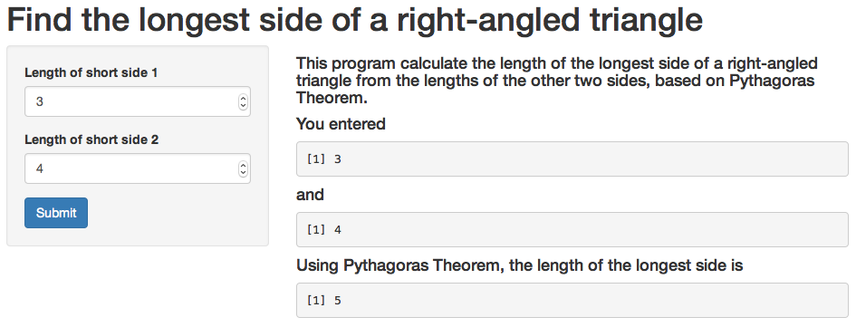

## Snapshot


--- .class #id 

## Overview
This program calculate the length of the longest side of a right-angled triangle from the lengths of the other two sides, based on Pythagoras Theorem.

$$c = \sqrt{a^2 + b^2}$$

where a, b and c are the 3 sides of a triangle, out of which c is the longest side.

---

## Program Computations

```r
a <- 3
b <- 4
c <- sqrt(a^2 + b^2)
c
```

```
## [1] 5
```

---

## Summary
# Advantages
- fast
- convenient
- simple

# Drawbacks
- limited to right-angled triangles only


